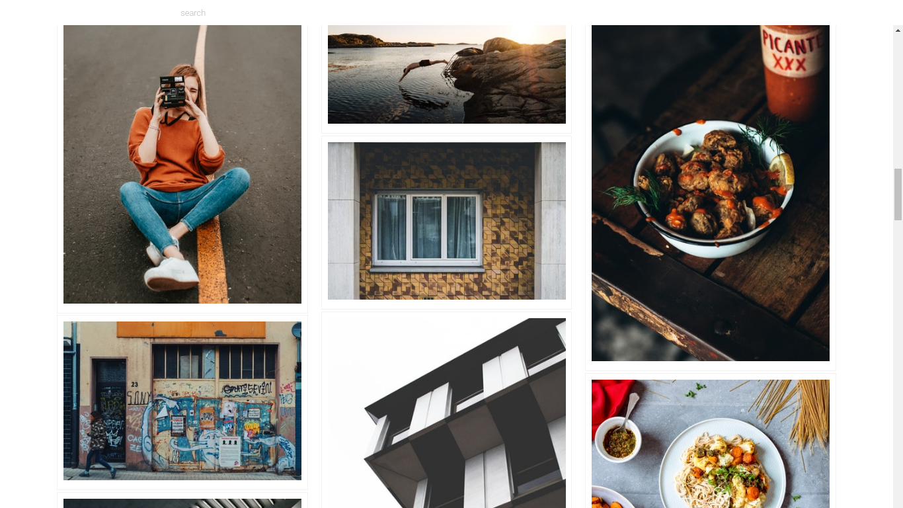
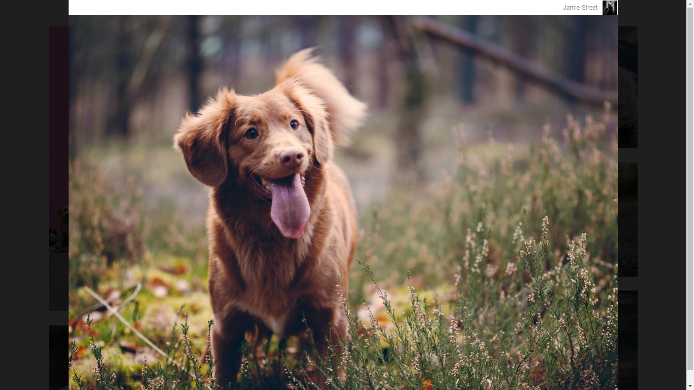
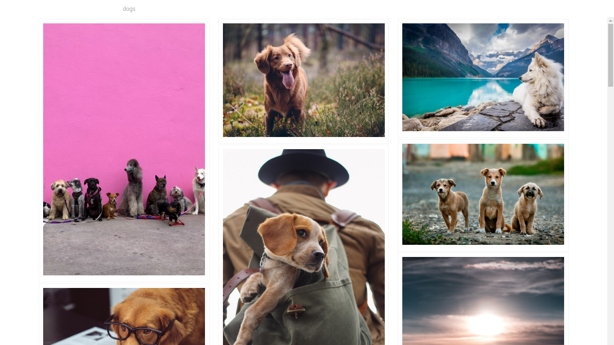

# Vue Unsplash







## Build Setup

``` bash
# install dependencies
$ yarn install #or npm

# serve with hot reload at localhost:3000
$ yarn run dev

# build for production and launch server
$ yarn run build
$ yarn start

# generate static project
$ yarn run generate
```

